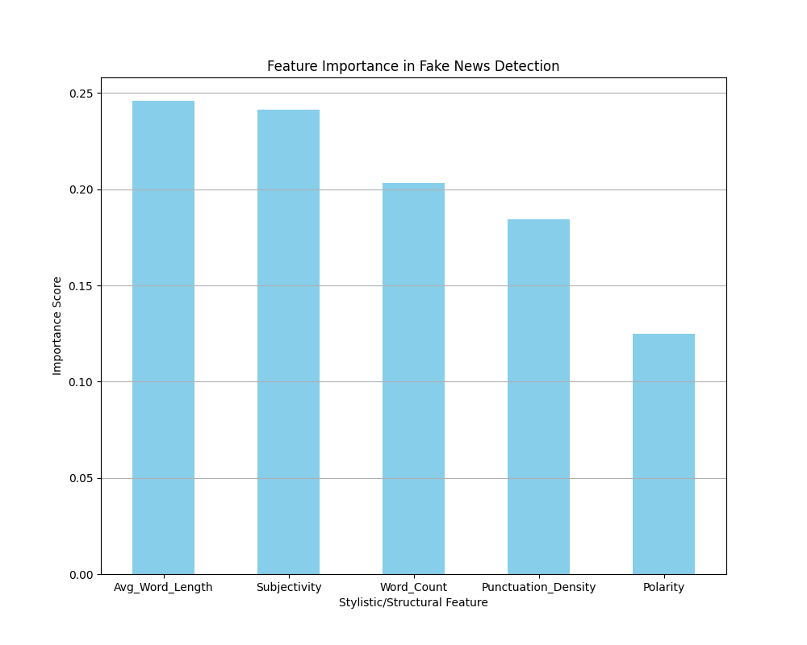

# Fake News Detection — NLP & Logistic Regression
 
A collaborative data science project by **Hayden Samala** (Mathematics of Computation, UCLA) and **Kavin Ramesh** (Statistics & Data Science, UCLA).
 
We trained a fine-tuned **RoBERTa-base** transformer and a **logistic regression** classifier to distinguish real from fake news articles, achieving **99.64% accuracy** on a held-out test set.
 
---
 
## Table of Contents
- [Overview](#overview)
- [Dataset](#dataset)
- [Tech Stack](#tech-stack)
- [Exploratory Data Analysis](#exploratory-data-analysis)
- [Logistic Regression](#logistic-regression)
- [NLP Model (RoBERTa-base)](#nlp-model-roberta-base)
- [Key Findings](#key-findings)
- [Repo Structure](#repo-structure)
 
---
 
## Overview
 
Given a news article, the goal is to classify it as **real** or **fake**. We approached this two ways:
 
1. **Logistic Regression** — baseline classifier trained on engineered stylometric features (word count, subjectivity, polarity, punctuation density, avg word length).
2. **Fine-tuned RoBERTa-base** — transformer model fine-tuned on article text for sequence classification.
 
---
 
## Dataset
 
[Fake News Detection Datasets — Kaggle](https://www.kaggle.com/datasets/emineyetm/fake-news-detection-datasets)
 
News articles from **2015–2017** split across `True.csv` and `Fake.csv`. We discovered and corrected two data quality issues before model training (see [Key Findings](#key-findings)).
 
---
 
## Tech Stack
 
| Category | Tools |
|---|---|
| Language | Python |
| NLP / ML | HuggingFace Transformers, scikit-learn |
| Preprocessing | pandas, NLTK, TextBlob |
| Visualization | matplotlib, seaborn, wordcloud |
| Training Environment | Google Colab (GPU) |
 
---
 
## Exploratory Data Analysis
 
We engineered and analyzed five stylometric features across both corpora to surface distributional differences between real and fake articles.
 
**Heatmap Correlation**
 

 
**Feature Importance**
 

 
**Word Count Distribution**
 

 
**Word Clouds — Fake vs Real**
 

 
---
 
## Logistic Regression
 
A logistic regression classifier trained on the engineered feature set, evaluated via confusion matrix and probability distributions.
 
**Confusion Matrix**
 

 
**Prediction Probability Distribution**
 

 
**Probabilities by Label**
 

 
**Prediction Distribution**
 

 
---
 
## NLP Model (RoBERTa-base)
 
We fine-tuned `roberta-base` for binary sequence classification. Training ran for up to 10 epochs; the final production run used 3 epochs on Google Colab.
 
### Round 1 — Pre-data-cleaning (Overfitting)
 
| Metric | Score |
|---|---|
| Accuracy | 0.9986 |
| F1 | 0.9986 |
| Precision | 0.9986 |
| Recall | 0.9986 |
| Loss | 0.0125 |
| Epoch | 10 |
 
> Results were suspiciously high. Investigation revealed every article in `True.csv` contained a "REUTERS" tag, and `subject` labels differed between fake and real files — both acted as near-perfect classifiers, inflating all metrics.
 
### Round 2 — Post-data-cleaning
 
| Metric | Score |
|---|---|
| Accuracy | 0.9964 |
| F1 | 0.9963 |
| Precision | 0.9958 |
| Recall | 0.9967 |
| Loss | 0.0259 |
| Epoch | 10 |
 
### Round 3 — 3 Epochs (Google Colab)
 
| Metric | Score |
|---|---|
| Accuracy | 0.9964 |
| F1 | 0.9963 |
| Precision | 0.9963 |
| Recall | 0.9963 |
| Loss | 0.0293 |
| Epoch | 3 |
 
Performance held steady at 3 epochs, confirming that RoBERTa converges quickly on this task.
 
**Model Performance Comparison**
 

 
---
 
## Key Findings
 
**Data leakage is easy to miss.** The REUTERS byline tag and differing `subject` distributions between the two CSV files acted as trivial shortcuts for the model. We caught this by interrogating why Round 1 accuracy was implausibly high, then stripped all source tags and dropped the subject column before retraining.
 
**Downstream fine-tuning matters.** RoBERTa's pretraining gives a strong general language representation, but without fine-tuning on a relevant task the model essentially memorizes surface-level artifacts rather than learning meaningful semantic signals.
 
**Stylometric features carry signal.** Even before any deep learning, features like subjectivity, polarity, and punctuation density showed meaningful distributional differences between real and fake articles — useful as a lightweight baseline or interpretability layer.
 
---
 
## Repo Structure
 
```
Fake-News-Analysis/
├── Models/                  # Training scripts and saved model checkpoints
├── Visualizations_Codebase/ # Code that generated all charts
├── Visualizations_png/      # Output PNG files for all visualizations
└── README.md
```
 
---
 
## Contributors
 
| Name | Major | GitHub |
|---|---|---|
| Hayden Samala | Mathematics of Computation, UCLA | [@hsamala688](https://github.com/hsamala688) |
| Kavin Ramesh | Statistics & Data Science, UCLA | [@kavinramesh](https://github.com/Kavin-Ramesh)|
 
> All commits were pushed by Hayden due to a GitHub access issue on Kavin's end. Work was split equally between both contributors.
